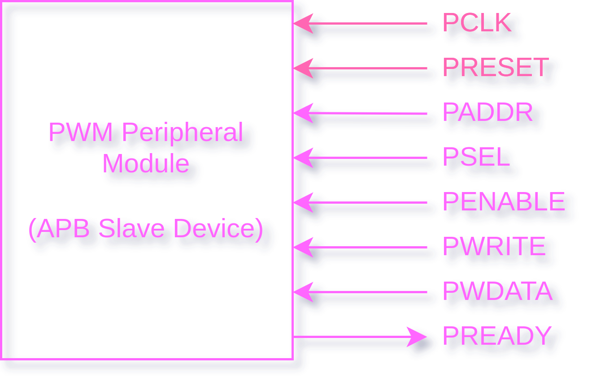
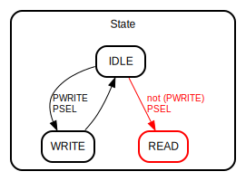
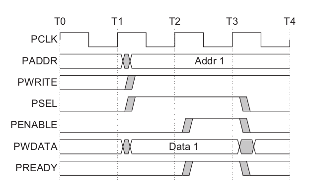
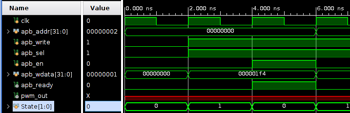

# PWM Module with APB Interface

The PWM controller can be programmed from an APB interface. Its features the following pinout.

This PWM Module supports APB 3 (AMBA 3 APB Protocol Specificiation v1.0) standarts. 

## PWM Module APB Interface Signals
 

Module Only Supports **Write Transfer With No Wait** States That Why There Is No `PRDATA` Signal.

Read Transfer is not currently supported. Following picture shows State Mechine Diagram of APB Slave Device.

 

 

## Test for Write Transfer With No Wait States

`APBMaster.v` Testbench acts like physical APB Bridge and apply *Write Transfer With No Wait States* signals to *APB PWM Slave Module*. 

As seen in the simulation results, Testbench signals exactly matches the waveform in the specification. As a result Slave Device write `PWDATA` to related *Registers* that `PADDR` indicates to.

  
   

## PWM Module Registers 

| Register               | Address | Width  | Type  |
| ---------------------- | ------- | ------ | ----- |
| PWM Enable             | 0x0     | 1-Bit  | write |
| PWM Duty Cycle (Width) | 0x1     | 32-Bit | write |
| PWM Frequency          | 0x0     | 32-Bit | write |

---

`PWM Enable` : PWM Enable Register. 

`PWM Duty Cycle (Width)` : Indicates PWM Duty Cycle Percentage.

It takes 32 bit value. 

- 32'h00000000 = %0 Duty Cycle
- 32'h01111111 = %50 Duty Cycle
- 32'h11111111 = %100 Duty Cycle

